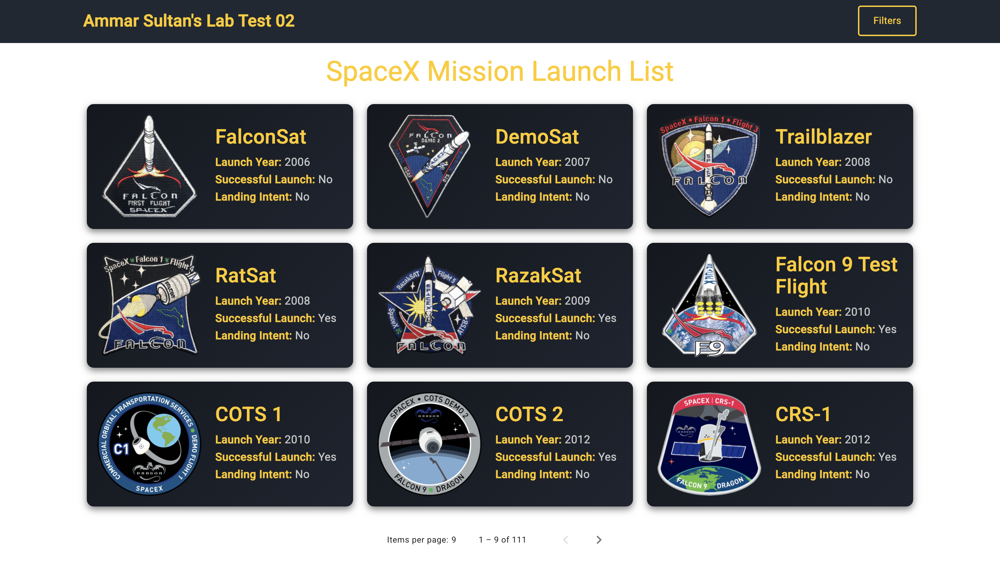
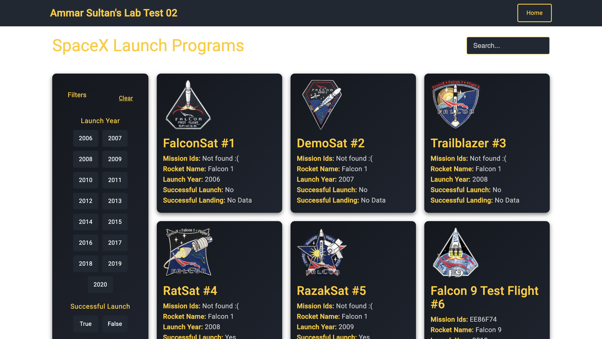
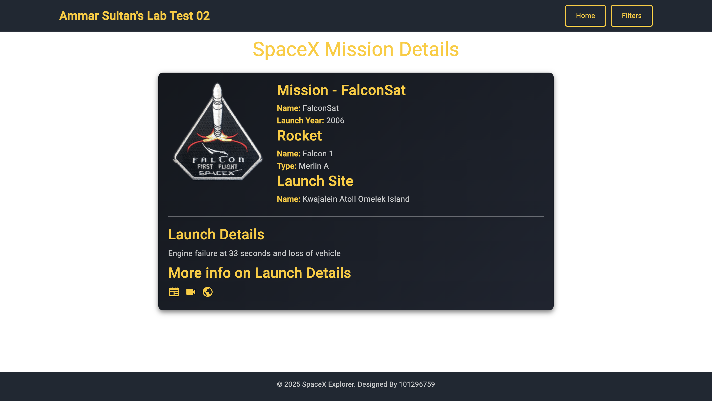

# 101296759 Lab Test2 - COMP3133

## Screenshots





<!-- Live Demo Button -->
<a href="YOUR_LIVE_APP_LINK" target="_blank">
  <button>View Live Demo</button>
</a>

---

## Overview

**101296759-lab-test2-comp3133** is an Angular application designed to display SpaceX launch data in a user-friendly interface. It retrieves launch information from the SpaceX REST API and presents details such as:

- **Flight Number**
- **Mission Name**
- **Launch Year**
- **Mission Details**
- **Mission Patch (small)**
- **Rocket Information:** (Name and Type)
- **Links:** Related articles, Wikipedia pages, and videos

Users can filter missions by launch year and view detailed information about each mission.

---

## Features

- **Mission List:** Displays all SpaceX launches with key details.
- **Mission Filter:** Allows filtering of missions based on their launch year.
- **Mission Details:** Provides an in-depth view of a selected mission.
- **Data Service:** Uses a dedicated Angular service to fetch and manage API data.
- **Data Structure:** Implements an interface/class to structure the fetched data.
- **Responsive Design:** Utilizes Angular Material components for a modern and responsive UI.

---

## Application Structure

- **Components:**
  - `missionlist` - Renders the list of SpaceX missions.
  - `missionfilter` - Provides filtering functionality by launch year.
  - `missiondetails` - Displays detailed information about a selected mission.
- **Service:**
  - A dedicated service to handle data fetching from the SpaceX REST API.
- **Data Model:**
  - Interfaces or classes define the structure of the API data.

---

## Deployment

The application is hosted on a live platform. Click the **"View Live Demo"** button at the top to visit the deployed version.

---

## Setup and Installation

Follow these steps to set up and run the application locally:

1. **Navigate to the Project Directory:**

   ```bash
   cd 101296759-lab-test2-comp3133
   ```

2. **Install Dependencies:**

   ```bash
   npm install
   ```

3. **Run the Application:**

   ```bash
   ng serve
   ```

4. **Access the Application:**

   Open your browser and navigate to http://localhost:4200/. css Copy
